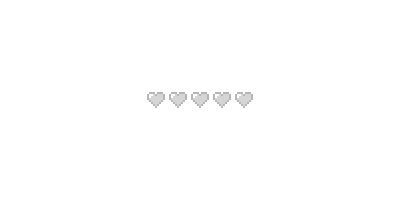

•───────────────────────────────────────────────────────────────────────────────•

  

•───────────────────────────────────────────────────────────────────────────────•

  

ＳＯＭＥ ＩＮＦＯＲＭＡＴＩＯＮ

— ᴄ+ʜ ɪғ ʏᴏᴜ ᴡᴀɴᴛ, ɪ ᴅᴏɴ'ᴛ ᴍɪɴᴅ 

— ɪғ ʏᴏᴜ ᴡᴀɴᴛ ᴛᴏ sɪᴛ ᴀɴᴅ ᴄʜɪʟʟ, ᴄᴏᴍᴇ sɪᴛ ɴᴇxᴛ ᴛᴏ ᴍᴇ   

— ɪғ ɪ ᴍᴏᴠᴇ ᴀᴡᴀʏ ғʀᴏᴍ ᴛʜᴇ sᴄʀᴇᴇɴ-ɪ'ᴍ sʟᴇᴇᴘɪɴɢ

— ɪ ᴅᴏɴ'ᴛ ʟɪᴋᴇ ɪᴛ ᴡʜᴇɴ ᴍʏ sᴋɪɴs ᴀʀᴇ ᴄᴏᴠᴇʀᴇᴅ

— ᴡʜᴇɴ ɪ ɢᴇᴛ ʙᴏʀᴇᴅ ᴏғ sɪᴛᴛɪɴɢ sᴛɪʟʟ, ɪ ɢᴏ ᴛᴏ ᴛʜᴇ sʜɪᴘ ᴛᴏ ʟᴏᴏᴋ ғᴏʀ ʀᴘ
 

  

•───────────────────────────────────────────────────────────────────────────────•

  

•───────────────────────────────────────────────────────────────────────────────•

<!--
**sapshes/sapshes** is a ✨ _special_ ✨ repository because its `README.md` (this file) appears on your GitHub profile.

Here are some ideas to get you started:

- 🔭 I’m currently working on ...
- 🌱 I’m currently learning ...
- 👯 I’m looking to collaborate on ...
- 🤔 I’m looking for help with ...
- 💬 Ask me about ...
- 📫 How to reach me: ...
- 😄 Pronouns: ...
- ⚡ Fun fact: ...
-->
